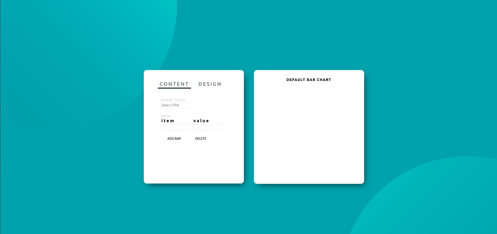

# Bar Chart Project

## About

This is a bar Chart Project for the prep module of Lighthouse Labs Bootcamp

## Objective

This project is attempt to create a simple bar chart generator API and experiments with UI/UX design with HTML, CSS, Javascript and jQuery

## Screen Shots

## Features

- Real time title edit and color cutomization
- bar, axis, value, label color cutomization
- bar chart size, bar spacing cutomization

## issues

- No default bar generated when user visit the main page
- The test interface does not have a valid input table, user has to delete each - bar one by one
- The bar will crash If user input a larger number for height and width
- Did not get ticks customization to work

## Features in Progress

- axis label customization
- Number of ticks cutomization
- mobile friendly (responsive) UI

## External resources

[color Picker](https://github.com/philzet/ColorPick.js)
[jQuery UI Documentation](https://api.jqueryui.com/)
[jQuery Documentation](https://api.jquery.com/)
[Hosam Dahrooge's bar chart example](https://github.com/Just-Hosam/barChartStretch)
[MDN](https://developer.mozilla.org/en-US/docs/Web/JavaScript)
[w3Schools](https://www.w3schools.com/)
